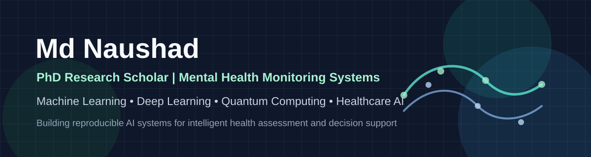

  

<h1 align="center">Md Naushad</h1>

  <strong>PhD Research Scholar at NIT Sikkim | Mental Health Monitoring Systems | ML, Deep Learning & Quantum Computing</strong>

  
  
  
  

---

## Research Profile

I am a Computer Science researcher focused on **AI-driven mental health monitoring systems** using machine learning, deep learning, and quantum computing. My PhD work explores intelligent models for mental health assessment, behavioral pattern recognition, predictive analytics, and clinical decision-support workflows.

My GitHub profile is maintained as a research and engineering portfolio: clean code, reproducible experiments, documented methodology, evaluation metrics, and results that can be understood, verified, and extended.

## Current Research Direction

**Mental Health Monitoring System using ML, Deep Learning, and Quantum Computing**

The goal is to design intelligent, responsible, and reproducible AI models that can support mental health assessment and monitoring. The work combines healthcare AI, predictive modeling, deep learning architectures, explainable AI, and quantum machine learning exploration.

## Core Research Areas

- Mental health monitoring and healthcare AI
- Machine learning and deep learning for intelligent assessment systems
- Quantum computing and quantum machine learning
- Predictive modeling, classification, and decision support
- Explainable AI, responsible AI, and reproducible research
- Time-series forecasting and applied deep learning

## Research Focus

| Focus | Description |
| --- | --- |
| Mental Health Monitoring | AI-based systems for mental health assessment, early signal detection, and decision support |
| Deep Learning | Neural models for pattern recognition, classification, and prediction |
| Quantum Computing | Exploring quantum and hybrid quantum-classical methods for healthcare AI |
| Explainable AI | Making model decisions more interpretable and useful for sensitive domains |
| Reproducible ML | Structured experiments, metrics, visualizations, and documented workflows |

## Technical Stack

**Programming and Data**

**AI and Machine Learning**

**Research Tools**

## Project and Research Portfolio

| Area | What I Work On |
| --- | --- |
| Healthcare AI | Mental health monitoring, intelligent assessment, and decision-support systems |
| Deep Learning | Classification, prediction, representation learning, and model evaluation |
| Quantum ML | Quantum-inspired and hybrid quantum-classical machine learning exploration |
| Environmental AI | PM2.5 forecasting and air-quality prediction using deep learning |
| Full-Stack Systems | Database-backed applications with clean interfaces and practical workflows |

## Publications and Academic Work

- Ongoing PhD research on mental health monitoring systems using ML, deep learning, and quantum computing
- Multi-Scale Attention-Based Hybrid Deep Learning Model for PM2.5 Prediction
- Deep Learning-Assisted Forensic Analysis
- Teaching and academic experience in Computer Science and Engineering

## Repository Quality Standard

For research and portfolio repositories, I aim to include:

- Clear problem statement and motivation
- Dataset description and preprocessing details
- Model architecture and experiment workflow
- Reproducible setup with requirements and execution steps
- Evaluation metrics, result tables, and comparison plots
- Training curves, prediction graphs, screenshots, or diagrams where useful
- Clean folder structure and readable code

## GitHub Analytics

  
  

  

## Connect

  
  
  

---

  <strong>Building responsible AI systems for mental health, healthcare intelligence, and reproducible research.</strong>

